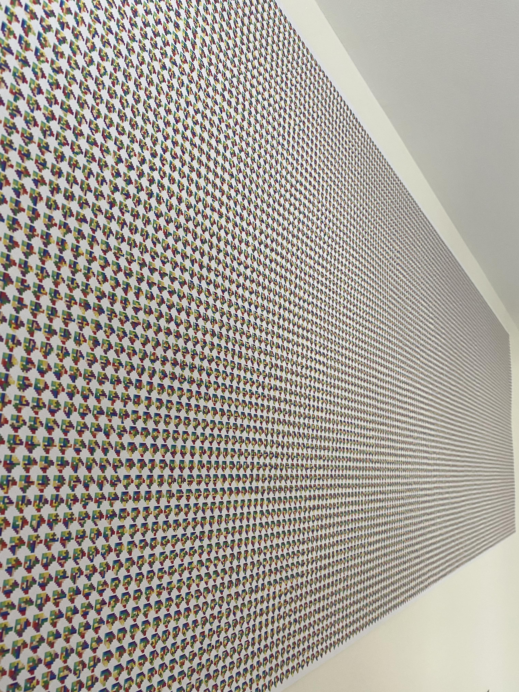

# Lonpos Solver

An algorithm that solves a little puzzle game where you must fit all the little pieces into a grid without
leaving any gaps and using all the pieces. I found it really hard to do, so I wanted to create a bot to do it for me,
as well as finding all possible solutions.

This algorithm finds 21,200 solutions to the puzzle which is exactly the same as what the outside of the box claims.
Running it on four separate threads, it was able to find them all in under an hour
(Pretty good considering there are millions of possibilities)

Also contained in `render.py` are a bunch of methods to visualise the solutions found, either in the command line or as an image.
Using a [pesudo-hilbert curve](https://gist.github.com/vobenhen/c4455327589094c277e16641d6f4b7ab) these solutions can be laid
out on a grid where the most similar solutions are nearest to each other. This layout can be exactly a hilbert curve if a square is specified (sides length being a power of 2),
however I wanted it to be more generic such as long rectangle of solutions. This means I could hypothetically print out all 21,200 solutions on a 3m roll.... 

See `pictures/` for all the solutions in various layouts. `solutions/` contains all the solutions in compressed numpy arrays, use `view()` to view them.

## Usage
99% of the methods you want to call are located in `run.py` the other files are just helper methods and stuff. A 4 line example is in `go.py`

`numpy` is required for most methods, `blessings` is just for fancy CMD line output and `pypng` is for saving the image.

If you find it useful let me know, as I'd love to hear about it
